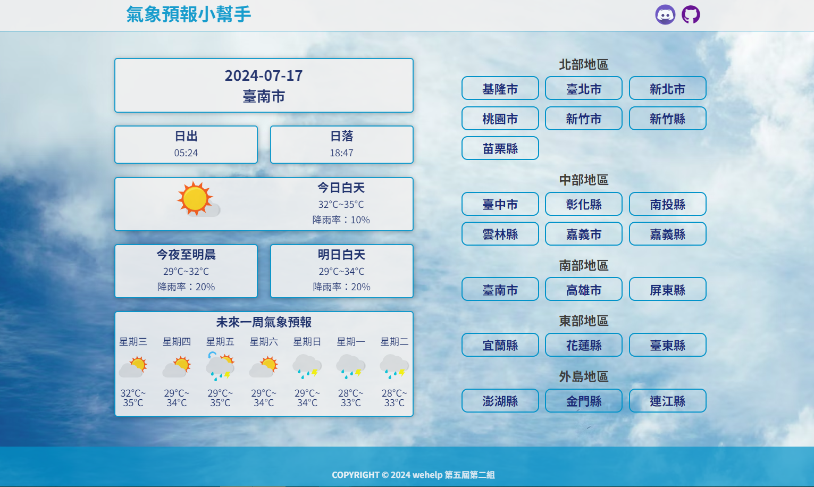
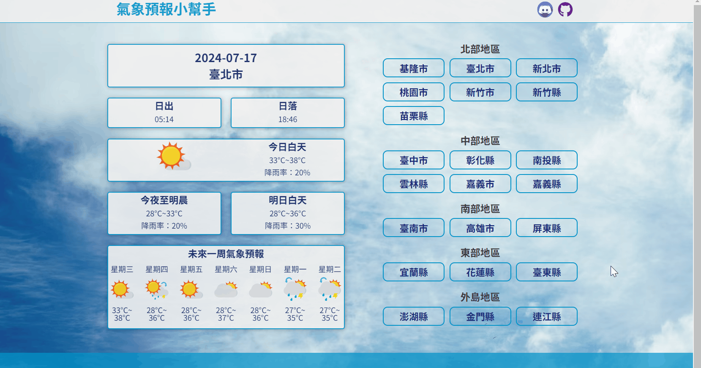
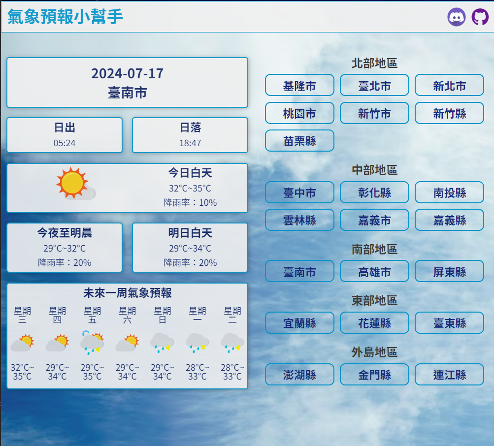
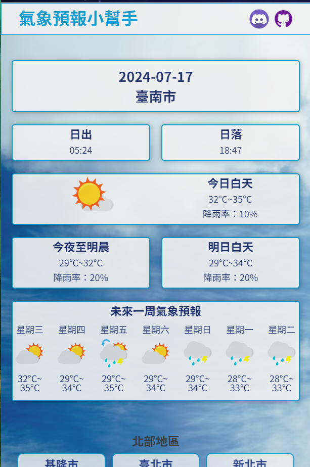
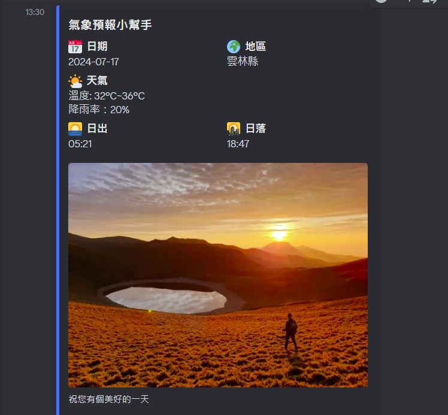
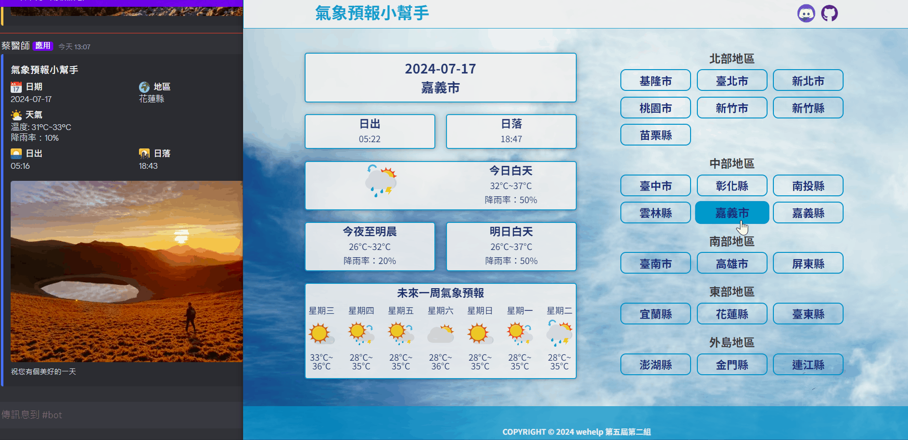

## WeHelp-Week8-Team2
## 氣象預報站

### 網址
<https://shu-ya318.github.io/wehelp-week8-team2/>

### 成員
謝淑雅(組長)、林耿弘、游如婕、鄭克萱、詹硯喬

### 說明
此為小組合作專案，利用[中央氣象署開放資料](https://opendata.cwa.gov.tw/dist/opendata-swagger.html)製作一各地區天氣網站，以利使用者查詢各地區現在、36小時內氣象及一週天氣預報。

### Demo
**(1) 點擊右方不同地區，會於左側相對應顯示該地目前天氣、氣溫、降雨機率、日出日落時間、36小時天氣及一週天氣預報**

**(2) RWD 頁面展示：在1200px以下版面有做些微調整，以適應視窗寬度**

**(3) RWD 頁面展示：在576px以下版面有做版面調整，以適應視窗寬度**

**(4) Discord Webhook 連動：點擊右上的 Discord Icon 可以發布頁面上地區氣象至 Discord 頻道中**

### 組內分工
+ **謝淑雅(組長)**&nbsp;&nbsp;
    + 於 GitHub 開設專案，負責 Merge 組員檔案
    + 整體網站規劃與切版、RWD 設計
    + 最終版面統整與 GitHub Pages 發布

+ **林耿弘&nbsp;&nbsp;**
    + 現在日期、地區區塊渲染
    + Fetch 各地區日出日落時間 API 與頁面渲染
    + Discord Webhook 連動

+ **鄭克萱&nbsp;&nbsp;**
    + Fetch 36 小時（今晚明晨、明日白天、明日夜間）氣溫、降雨機率 API 與頁面渲染

+ **游如婕&nbsp;&nbsp;**
    + Fetch 未來一週氣象預報 API 與頁面渲染

+ **詹硯喬&nbsp;&nbsp;**
    + 地區區塊排版與地區選擇監聽事件
    + DEMO 製作與 README 撰寫

